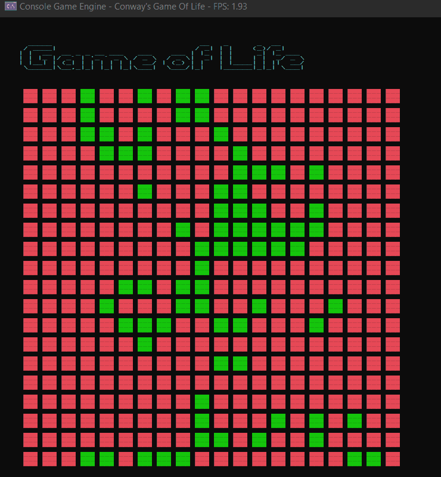

# Introduction

Conway's Game of life is a cellular automaton. It is based on three simple rules.
1. A dead cell with exactly 3 neightbours will come to life.
2. A living cell with more than 3 neighbours will die as of overpopulation.
3. A living cell with less than 2 neighbours will die as well as of underpopulation
4. A living cell with exactly 2 or 3 neighbours will stay alive as of reproduction.


# Build

[NOTE: to be compiled using msvc toolchain]

```console
> build.bat
> out.exe
```

# out.exe

