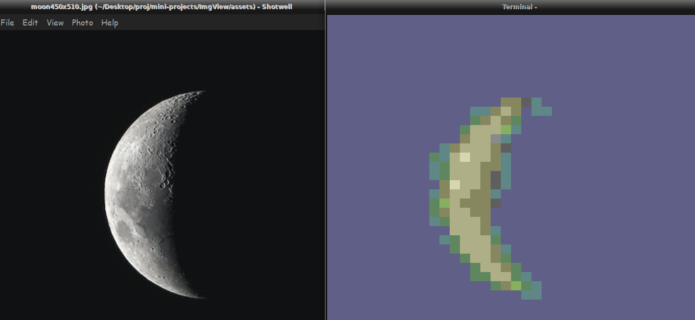
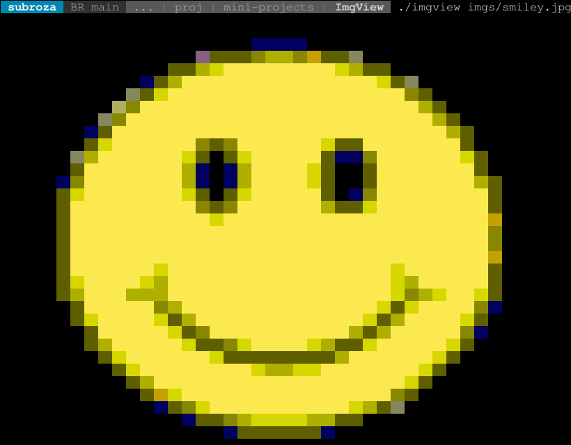

# Introduction
An image viewer that uses the terminals support for colors to render an image pixel by pixel onto the terminal.

## 8-bit colors 
For Terminals supporting only 16 colors a function approximates the color based on the pixel value.
the hsl color space is used, rgb value of the pixel is converted to the hsl value and the nearest matching color is used.

## Truecolor supporting terminals
Some terminal support Truecolor which is 24-bit color system which is the same as that used in jpg no approximation is required the exact color of the pixel can be rendered. To be implemented.

## COMPILE

```shell
./build.sh
./imgview $path_to_file
```

## OUTPUT


