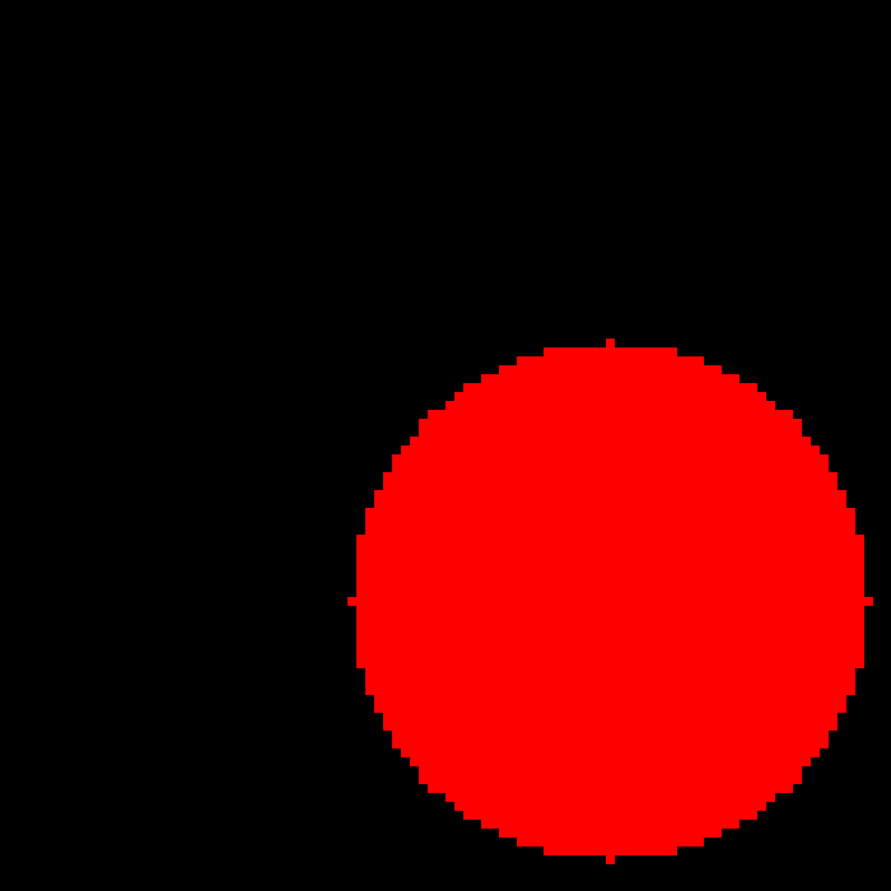
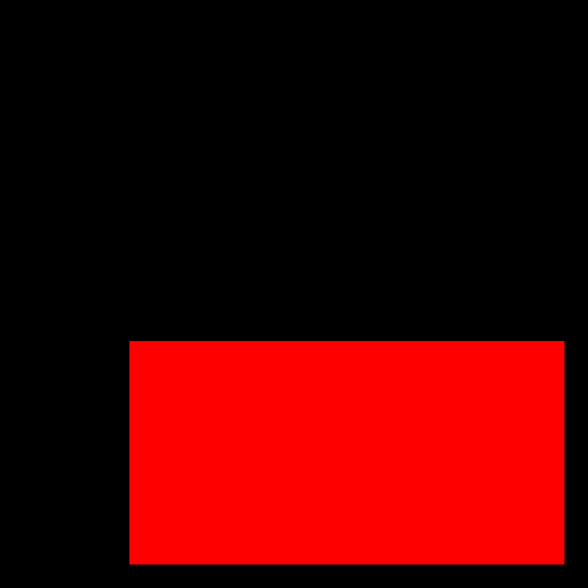
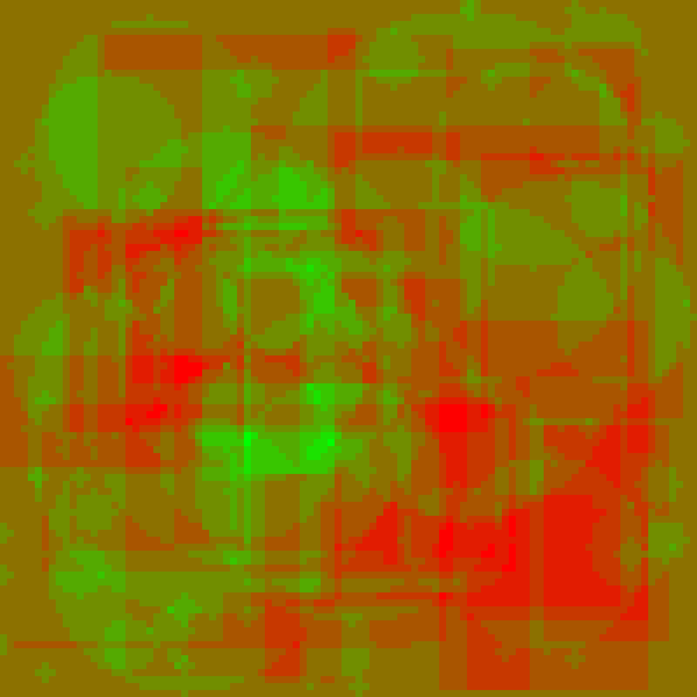
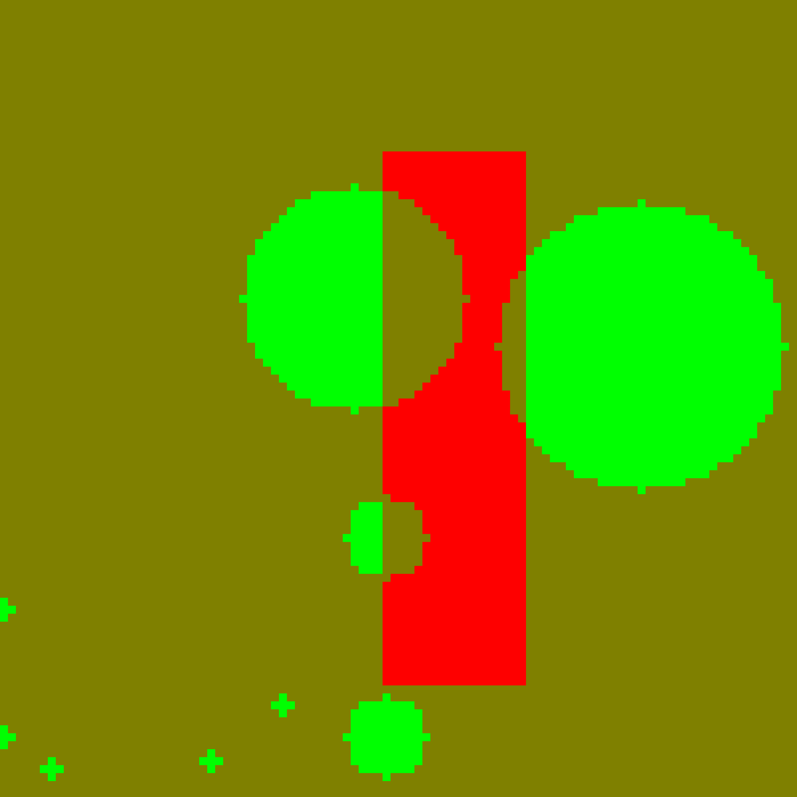

# Introduction

This a very basic neural network written in C. The objective of the system is to distinguish between a circle and a rectangle. The circles and rectangles are generated using an algorithm. The generated objects can be saved to disk in either **.ppm** or **.bin** format. The weight of neurons can be represented in a [graphical format](#Weight) to get an idea of the models working and it look cool :). Needless to say that the bigger the sample space and training pass the more accurate the system yield.

# Model

The layer of neuraons are a grid of float values representing their respective weights. The pixel value of each image containing a circle or a rectangle is multiplied with the respective neurons weight and all those are summed up and compared against a bias value if the summation value is more than the bias this indicates a cricle and hence 1 is returned, 1 is used just for indicative purposes. If the result is incorrect the weights are corrected i.e. if a 1 was expected and a 0 is returned the neurons need to be excited, simply add the pixel values to the weight in the opposite case the neurons need to be suppressed and hence we subtract the pixel values.

The following are the example for the trainining data generated

|Circle                   | Rectangle   				|
:------------------------:|:----------------------------:
|||

# Weight


<!---->

This is the weight of a model trained off a 100 object sample space. It is rendered as a **.pm**. The green value represents the +ve weight correction at some point in training while the red is for -ve weight corrections. The image below is the weight of a model trained off 10 objects, the rectangle and circles are clearly visible in the image and how the training passes affects the model.



The following is a gif demostrating the changes in the weight value during a training pass.


# Build
```console
./build.sh
./output
```
