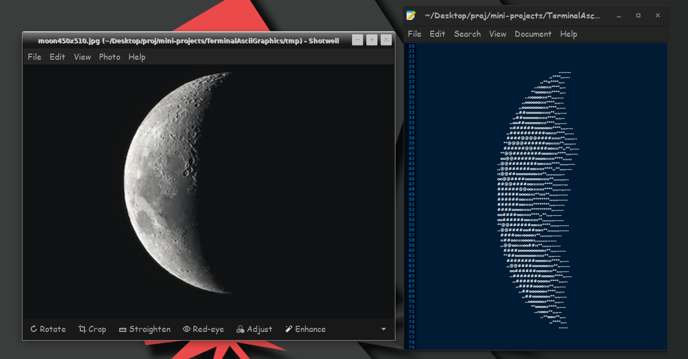

# TERMIAL ASCII GRAPHICS

### INTRODUCTION

An attempt to render graphics on terminal using ascii characters, creating high quality ascii art.  

### OUTPUT



The compiled code is given the file moon450x510.jpeg in the /assets directory and the output is appended to a txt file. The scalling factor (>=5) can be lowered enough to render it to the terminal, to have a high quality rendetion keep the scalling factor 5. 

### COMPILE 

```shell
gcc imgascii.c -o img -lm
./img tmp/moon450x510.jpeg > moon450x510.txt
```


# TERMINAL FPS

### INTRODUCTION

This is the rendation of a 3D space in a terminal using UNICODE characters. 

The code is written in C++. The code uses wolfenstein algorithm to find the starting of a wall from the players prespective by projecting a ray in the players FOV and determining the distance between the wall and the player location and the angle between them.


### OUTPUT

https://user-images.githubusercontent.com/89798490/198686305-3501bf91-106d-4a98-8000-46f90bc5c8e2.mp4


